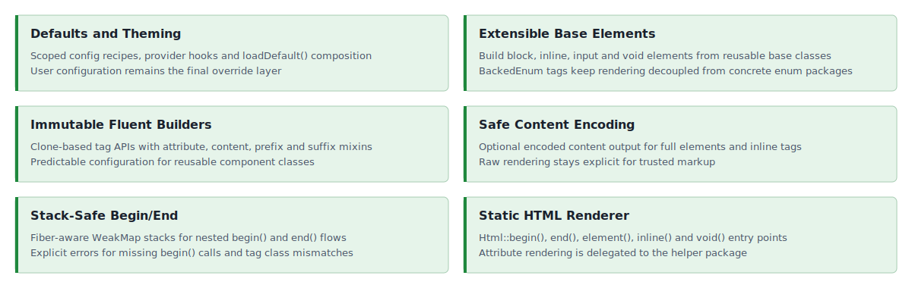

<!-- markdownlint-disable MD041 -->
<p align="center">
    <a href="https://github.com/ui-awesome/html-core" target="_blank">
        
    </a>
    <h1 align="center">Html Core</h1>
    <br>
</p>
<!-- markdownlint-enable MD041 -->

<p align="center">
    <a href="https://github.com/ui-awesome/html-core/actions/workflows/build.yml" target="_blank">
        
    </a>
    <a href="https://dashboard.stryker-mutator.io/reports/github.com/ui-awesome/html-core/main" target="_blank">
        
    </a>
    <a href="https://github.com/ui-awesome/html-core/actions/workflows/static.yml" target="_blank">
        
    </a>
    <a href="https://github.com/ui-awesome/html-core/actions/workflows/security.yml" target="_blank">
        
    </a>
</p>

<p align="center">
    <strong>A type-safe PHP library for standards-compliant HTML tag rendering</strong><br>
    <em>Build and render block, inline, input, and void elements with immutable fluent APIs.</em>
</p>

## Features

<picture>
    <source media="(max-width: 767px)" srcset="./docs/svgs/features-mobile.svg">
    
</picture>

### Installation

```bash
composer require ui-awesome/html-core:^0.6
```

### Quick start

#### Rendering HTML tags with enums

Renders begin/end tags and full elements using standards-compliant tag enums.

```php
<?php

declare(strict_types=1);

namespace App;

use UIAwesome\Html\Core\Html;
use UIAwesome\Html\Interop\{Block, Inline, Voids};

echo Html::begin(Block::DIV, ['class' => 'container']);
// <div class="container">

echo Html::inline(Inline::SPAN, 'Hello');
// <span>Hello</span>

echo Html::end(Block::DIV);
// </div>
```

#### Rendering a full element (with optional content encoding)

```php
<?php

declare(strict_types=1);

namespace App;

use UIAwesome\Html\Core\Html;
use UIAwesome\Html\Interop\Block;

$content = '<span>Test Content</span>';

echo Html::element(Block::DIV, $content, ['class' => 'test-class']);

// <div class="test-class">
// <span>Test Content</span>
// </div>

echo Html::element(Block::DIV, $content, ['class' => 'test-class'], true);

// <div class="test-class">
// &lt;span&gt;Test Content&lt;/span&gt;
// </div>
```

#### Rendering void elements with structured attributes

Void tags render without closing tags. Complex attributes (like `class` arrays and `data` arrays) are rendered via the
installed `ui-awesome/html-helper` dependency.

```php
<?php

declare(strict_types=1);

namespace App;

use UIAwesome\Html\Core\Html;
use UIAwesome\Html\Interop\Voids;

echo Html::void(
    Voids::IMG,
    [
        'class' => ['void'],
        'data' => ['role' => 'presentation'],
    ],
);

// 
```

#### Input elements with prefix/suffix templates

Input elements render the input tag with optional prefix and suffix segments through the same template primitives used
by inline elements.

```php
<?php

declare(strict_types=1);

namespace App;

use BackedEnum;
use UIAwesome\Html\Core\Element\BaseInput;
use UIAwesome\Html\Interop\{Inline, Voids};

final class SearchInput extends BaseInput
{
    protected function getTag(): BackedEnum
    {
        return Voids::INPUT;
    }

    protected function run(): string
    {
        return $this->buildElement();
    }
}

echo SearchInput::tag()
    ->type('search')
    ->name('q')
    ->prefix('Search')
    ->prefixTag(Inline::LABEL)
    ->render();

// <label>Search</label>
// <input name="q" type="search">
```

#### Building custom elements with immutable fluent APIs

Create your own element classes by extending the provided base elements.

```php
<?php

declare(strict_types=1);

namespace App;

use UIAwesome\Html\Core\Element\BaseBlock;
use UIAwesome\Html\Interop\Block;
use BackedEnum;

final class Div extends BaseBlock
{
    protected function getTag(): BackedEnum
    {
        return Block::DIV;
    }
}

echo Div::tag()
    ->class('card')
    ->content('Content')
    ->render();

// <div class="card">
// Content
// </div>
```

#### Nested rendering with `begin()` / `end()`

`BaseBlock` supports stack-based begin/end rendering, with protection against mismatched tags.

```php
<?php

declare(strict_types=1);

namespace App;

use UIAwesome\Html\Core\Element\BaseBlock;
use UIAwesome\Html\Interop\Block;
use BackedEnum;

final class Div extends BaseBlock
{
    protected function getTag(): BackedEnum
    {
        return Block::DIV;
    }
}

echo Div::tag()->begin();
echo 'Nested Content';
echo Div::end();

// <div>
// Nested Content
// </div>
```

#### Inline elements with prefix/suffix and templates

Inline elements can render prefix and suffix segments, optionally wrapped in their own tags.

```php
<?php

declare(strict_types=1);

namespace App;

use UIAwesome\Html\Core\Element\BaseInline;
use UIAwesome\Html\Interop\Inline;
use BackedEnum;

final class Span extends BaseInline
{
    protected function getTag(): BackedEnum
    {
        return Inline::SPAN;
    }

    protected function run(): string
    {
        return $this->buildElement($this->getContent());
    }
}

echo Span::tag()
    ->content('Content')
    ->prefix('Prefix')
    ->prefixTag(Inline::STRONG)
    ->suffix('Suffix')
    ->suffixTag(Inline::EM)
    ->render();

// <strong>Prefix</strong>
// <span>Content</span>
// <em>Suffix</em>
```

#### Application-scoped config recipes

Use an immutable `Config` instance to apply a design-system recipe without global mutable state. Multiple configs can be
used in the same process, and fluent calls made after `config()` are local overrides.

```php
<?php

declare(strict_types=1);

namespace App;

use UIAwesome\Html\Core\Config\{Call, ComponentContext, Config, Cookbook, Recipe};
use UIAwesome\Html\Core\Element\BaseInline;
use UIAwesome\Html\Core\Theme\ThemeInterface;
use UIAwesome\Html\Interop\Inline;
use BackedEnum;

final class Span extends BaseInline
{
    protected function getTag(): BackedEnum
    {
        return Inline::SPAN;
    }

    protected function run(): string
    {
        return $this->buildElement($this->getContent());
    }
}

final readonly class FlowbiteTheme implements ThemeInterface
{
    public function getName(): string
    {
        return 'flowbite';
    }

    public function getRecipes(ComponentContext $context): iterable
    {
        if ($context->component === 'badge') {
            yield new Recipe(
                'flowbite.badge',
                new Cookbook(new Call('class', 'rounded text-sm')),
            );
        }
    }
}

$config = new Config(new FlowbiteTheme());

echo Span::tag()
    ->config($config, new ComponentContext('badge'))
    ->id('badge-1')
    ->content('New')
    ->render();

// <span class="rounded text-sm" id="badge-1">New</span>
```

#### Class-level defaults with `loadDefault()`

For a simpler approach without separate provider classes, override `loadDefault()` in your tag class. These defaults are
applied automatically when `tag()` is called.

```php
<?php

declare(strict_types=1);

namespace App;

use UIAwesome\Html\Core\Element\BaseBlock;
use UIAwesome\Html\Interop\Block;
use BackedEnum;

final class Container extends BaseBlock
{
    protected function getTag(): BackedEnum
    {
        return Block::DIV;
    }

    protected function loadDefault(): array
    {
        return [
            'class' => 'container',
        ];
    }
}

echo Container::tag()->render();
// <div class="container">
// </div>

echo Container::tag(['class' => 'container-fluid'])->render();
// <div class="container container-fluid">
// </div>
```

Configuration priority (from weakest to strongest):

1. Class defaults from `loadDefault()`
2. Defaults passed to `tag()`
3. Application-scoped recipes applied by `config()`
4. Fluent local overrides called after `config()`

#### Extensibility

This library is agnostic and designed to be extended. You can define your own tag collections (for example, for SVG,
MathML, or Web Components) with custom string-backed enums.

- `Html::element()` handles generic open/content/close rendering.
- `Html::inline()` handles inline rendering.
- `Html::void()` handles void rendering.

You can create a custom enum for your specific domain and use it with `html-core`.

```php
enum SvgTag: string
{
    case SVG = 'svg';
    case G = 'g';
    // ... add other SVG block tags as needed
}

// now you can use it with the Html renderer or your custom classes
echo Html::element(SvgTag::G, '...');
// <g>...</g>
```

## Documentation

For detailed configuration options and advanced usage.

- 🧪 [Testing Guide](docs/testing.md)
- ⬆️ [Upgrade Guide](UPGRADE.md)

## Package information

[](https://www.php.net/releases/8.3/en.php)
[](https://packagist.org/packages/ui-awesome/html-core)
[](https://packagist.org/packages/ui-awesome/html-core)

## Project status

[](https://codecov.io/github/ui-awesome/html-core)
[](https://github.com/ui-awesome/html-core/actions/workflows/static.yml)
[](https://github.com/ui-awesome/html-core/actions/workflows/quality.yml)
[](https://github.styleci.io/repos/779611775?branch=main)

## Our social networks

[](https://x.com/Terabytesoftw)
[](https://www.facebook.com/wilmer.arambula.9)

## License

[](LICENSE)
